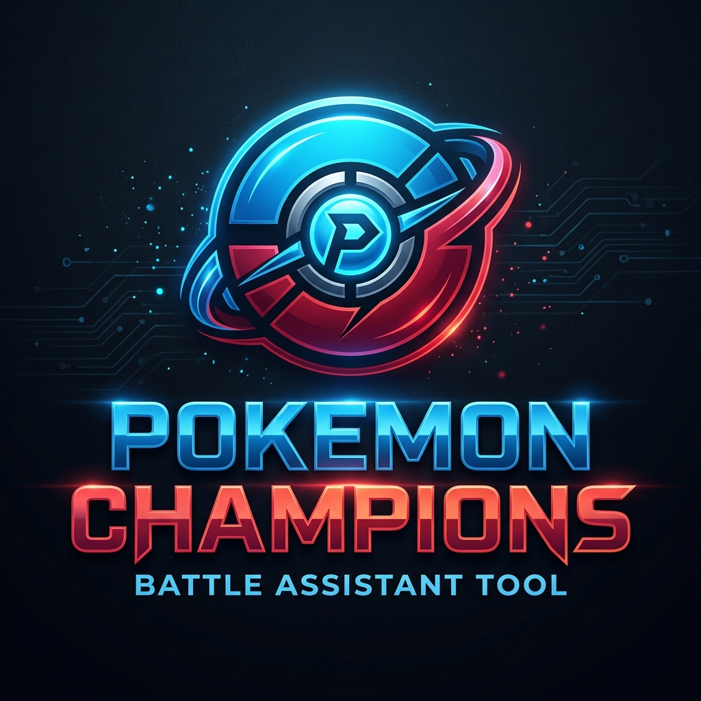

# 🏆 Pokemon Champions Battle Assistant v1.0

## 🌟 プロジェクト概要
**Pokemon Champions Battle Assistant** は、ポケモンの対戦をより戦略的かつ、直感的にサポートするために開発された高性能なバトルシミュレーション補助ツールです。
美しくモダンなUIと、最新の対戦環境データを即座に反映できる柔軟性を兼ね備えています。

### 🚀 主な機能
- **高精度ダメージ計算**: ランク補正、持ち物、タイプ相性（4倍弱点対応）を網羅した正確な計算エンジン。
- **最新環境データのインポート**: 外部CSV（対戦環境使用率データ等）をワンクリックで読み込み、マスターデータを最新化。
- **サジェスト機能**: 敵ポケモンの頻出技、持ち物、性格、調整データを瞬時に表示し、読み合いをサポート。
- **パーティ保存・管理**: 自陣のパーティ構成をプリセットとして保存し、瞬時に呼び出し可能。
- **プレミアムな操作性**: 50音ピッカーによる高速な入力、動的なHPゲージ表示、タイプ耐性の一覧表示。

---

## 🛠 セットアップ方法

Windows環境での利用を想定しています。

### 1. インストール
リポジトリをダウンロードまたはクローンした後、フォルダ内にある `install.bat` を実行してください。
以下の作業が自動で行われます：
- Python仮想環境（venv）の作成
- 必要なライブラリのインストール
- 初期マスターデータの取得

### 2. 起動
セットアップ完了後、 `start.bat` を実行してください。
バックエンドサーバーが立ち上がり、自動的にブラウザで操作画面が開きます。

---

## 📄 注意事項
　・本ツールは現在日本語のみに対応しています。(Only Japanese)
　・構築にAIを使っていることと対戦初心者のため、計算処理や動作などに多くの誤りを含んでいる可能性があります。(may contain bugs)
　・AIはGoogle Antigravityを使用しています。(Using GoogleAntigravity)
---

## ✒️ 作者
**Nekoruka**

---
*Disclaimer: This is a fan-made tool and is not affiliated with or endorsed by Nintendo, Creatures Inc., or GAME FREAK inc.*
